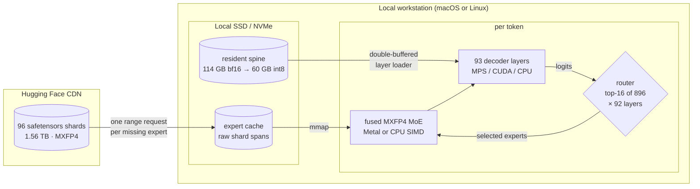
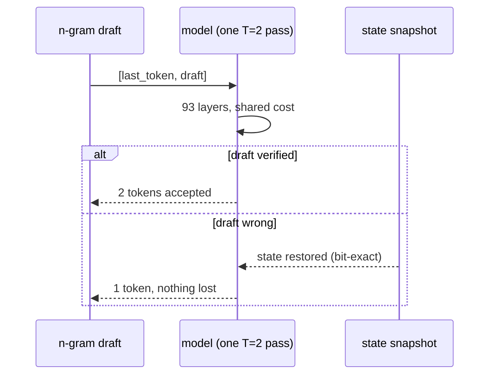

<div align="center">

```
   ____       _ _         __ _
        |  _ \  ___| | |_ __ _ / _(_)_ __
        | | | |/ _ \ | __/ _` | |_| | '_ \
        | |_| |  __/ | || (_| |  _| | | | |
        |____/ \___|_|\__\__,_|_| |_|_| |_|
```

### An experiment in running [Kimi K3](https://huggingface.co/moonshotai/Kimi-K3) (2.8T parameters) on one local workstation

Deltafin is a small research project that runs a Mixture-of-Experts model far
larger than the machine it sits on. It supports Apple Silicon macOS and
x86-64/aarch64 Linux, automatically selecting MPS, CUDA or CPU for the resident
model path and a compatible native MXFP4 expert kernel. The maintainer-run
reference is **0.0687 token/s (14.6 seconds/token)** on a modest 64 GB M1 Max;
that is one first-generation machine, not a ceiling for newer hardware.


-orange)


</div>

---

## Install

Clone the repository and enter it first; every path below is relative to the
Deltafin folder. The only real decision is step 3.

```bash
git clone https://github.com/gavamedia/deltafin.git
cd deltafin

# 1. environment (Python 3.12+)
python3 -m venv venv
./venv/bin/pip install torch numpy safetensors tiktoken ml_dtypes blobfile \
    "transformers==4.56.2" einops tokenizers

# 2. build and validate the native libraries for this host
python3 tools/build_native.py

# 3. download the model  (see the two modes below)
./venv/bin/python tools/setup_k3.py --full
```

On macOS, install Xcode Command Line Tools first (`xcode-select --install`). On
Linux, install a C/C++ compiler toolchain such as `build-essential` or GCC/Clang.
For an NVIDIA system, install a CUDA-enabled PyTorch build using the
[official PyTorch selector](https://pytorch.org/get-started/locally/) before
installing the remaining Python packages. Deltafin does not vendor PyTorch or a
CUDA runtime.

### Supported platforms

| Host | Resident model / attention | Routed-expert MoE |
|---|---|---|
| Apple Silicon macOS | MPS | Metal, with native CPU fallback |
| NVIDIA Linux, x86-64 or aarch64 | CUDA | native CPU MXFP4 |
| Linux x86-64-v3 (including AVX2/FMA3) | CPU | native SSSE3/FMA MXFP4 |
| Linux aarch64 | CPU | native NEON MXFP4 |

The NVIDIA path is deliberately described as hybrid: CUDA accelerates the
resident spine and attention, while routed MXFP4 experts still execute in the
native CPU kernel. There is not yet a native CUDA MXFP4 MoE kernel.
`build_native.py` selects `.dylib` or `.so`, applies the appropriate host ISA
flags, validates required symbols and ABI, and only then installs the artifacts.

### The two modes

| | `--full` (recommended) | `--stream` |
|---|---|---|
| Disk needed | **~1.7 TB** | **~215 GB** |
| Download time | 5–10 hours, resumable | ~30 minutes |
| Speed afterwards | **14.6 s/token median** on our M1 Max | ~3+ min/token for anything not already cached |
| Network at inference | none | constant |

Every token reads 16 experts × 92 layers = **25.8 GB of expert data**. From local
disk that's about 4 seconds; over the network it's minutes. That single fact is
the whole difference between the two columns.

Run `setup_k3.py` with no flag and it picks `--full` when the disk allows,
otherwise falls back to streaming and tells you exactly how much space you'd
need to free.

### Starting with streaming and upgrading later

Streaming is a fine way to try Deltafin without committing 1.7 TB. Whenever you
want the speed, one command finishes the job — no reinstall, no reconfiguration,
and it picks up whatever is already cached:

```bash
./venv/bin/python tools/fetch_experts_all.py          # resumable, run anytime
./venv/bin/python tools/fetch_experts_all.py --dry-run   # just show the numbers
./venv/bin/python tools/fetch_experts_all.py --layers 1-40   # partial is fine too
```

For a streaming install, an idle-time warmer can rank absent experts from
recorded router traces. Its default is a read-only plan; network fetching is
explicit, and it can atomically convert legacy `.npz` entries to the raw fast
format:

```bash
./venv/bin/python tools/warm_expert_cache.py
./venv/bin/python tools/warm_expert_cache.py --convert-npz --fetch 128
```

Deltafin prints a reminder at startup — both for the CLI and the API server —
whenever it's still in streaming mode, showing how much of the pool is local and
what finishing would cost.

### Optional: int8 spine

Halves per-token I/O for the non-expert weights, with no meaningful quality
change in our checks. Takes a few minutes:

```bash
./venv/bin/python tools/convert_spine_int8.py
```

## Usage

```bash
# ask a question; generates until the model finishes its answer
./venv/bin/python tools/kimi_run.py --chat --prompt "What are the three largest moons of Saturn?"

# raw completion (no chat template); runs until you press Ctrl-C, or cap it
./venv/bin/python tools/kimi_run.py --prompt "The capital of France is" --max-new 16
```

Tokens print as they are generated, so you always see the text as it comes.
Ctrl-C stops cleanly at any point and prints the result so far; `--max-new N`
caps the length. One honest warning: K3 thinks before it answers, and at roughly
4.1 tokens per minute a full chat answer can take a while — watching it stream
is part of the experience.

Set `K3_TRACE=buffered` to log router selections to `router_trace.jsonl` for
offline study. Performance runs leave tracing off.

## OpenAI-compatible server

Deltafin can serve the standard OpenAI API, so chat interfaces, the `openai` SDK
and coding agents can use it by changing a base URL:

```bash
./venv/bin/python tools/serve_openai.py --port 8000
```

```bash
curl http://127.0.0.1:8000/v1/chat/completions -H 'Content-Type: application/json' \
  -d '{"model": "deltafin-kimi-k3",
       "messages": [{"role": "user", "content": "Hello!"}]}'
```

```python
from openai import OpenAI

client = OpenAI(base_url="http://127.0.0.1:8000/v1", api_key="none")
r = client.chat.completions.create(
    model="deltafin-kimi-k3",
    messages=[{"role": "user", "content": "Hello!"}])

print(r.choices[0].message.content)            # the answer
print(r.choices[0].message.reasoning_content)  # K3's thinking, when present
```

`/v1/chat/completions`, `/v1/completions` and `/v1/models` are implemented, and
streaming (`"stream": true`) works. Most tools that read `OPENAI_BASE_URL` and
`OPENAI_API_KEY` will work by pointing those at the server.

Please read these caveats before pointing anything automated at it:

- **Time.** Answers arrive when they arrive — set your client's timeouts to
  hours, not seconds. Omitting `max_tokens` lets the model finish its answer
  (recommended); raw completions, which never end on their own, default to 256.
  Operators can set a hard ceiling with `K3_SERVER_MAX_TOKENS`.
- **Streaming installs are much slower here.** A chat-template prompt is 60
  tokens or more and prefill touches many experts per layer, so on a partly
  filled cache a chat request can spend hours fetching. With a full install it's
  just normal (slow) inference. The server prints a warning at startup when
  you're in streaming mode.
- **Greedy only.** `temperature` and `top_p` are accepted and ignored, and one
  request runs at a time (a second concurrent request gets a 429).
- **Agents are a curiosity, not a workflow.** Coding assistants work in
  principle, but their long system prompts make prefill expensive.

## Configuration

Everything works with no configuration: Deltafin picks the best available
device and the int8 spine when it has been built, and says what it chose at
startup. These variables exist for overriding that:

| Variable | Default | Meaning |
|---|---|---|
| `K3_DEV` | auto | `mps` when available, then `cuda`, otherwise `cpu`; accepts explicit `mps`, `cuda`, `cuda:N` or `cpu` |
| `K3_MOE` | auto | `metal` when the selected device is MPS and the library is available; `cpu` elsewhere |
| `K3_MODEL_DIR` | unset | official local Kimi-K3 directory; direct-shard mode reads its metadata, tokenizer, modeling code, index, and weights in place without creating `k3-meta`; see the [serial-token parity report](docs/m3ultra512-m2-serial-token.md) |
| `K3_EXPERT_SOURCE` | `cache-http` | `direct-shards` reads routed experts with positional I/O from an unmodified local official checkpoint; see [the M3 Ultra direct-shard report](docs/m3ultra512-direct-shards.md) |
| `K3_RESIDENT_SOURCE` | `cache-http` | `direct-shards` reads non-routed tensors from the same unmodified checkpoint; see the [complete MPS resident report](docs/m3ultra512-m1d-resident.md) |
| `K3_RESIDENT_BANK` | `0` | materialize the complete direct-shard resident inventory once and alias streamed layer parameters to that MPS storage; enabled by the 512 GB profile |
| `K3_RESIDENT_BANK_DTYPE` | `runtime` | `source` preserves each resident tensor's official checkpoint dtype in the permanent MPS bank, then creates only per-layer runtime-dtype scratch; the M3 Ultra 512 GB profile selects it after the [M8 cache-crossover validation](docs/m3ultra512-m8-cache-crossover.md) |
| `K3_RESIDENT_SCRATCH` | `0` | reuse one fixed FP32 arena for source-dtype layer materialization, including cached views and meta sentinels; the M3 Ultra 512 GB profile enables one slot; see the [M7 scratch](docs/m3ultra512-m7-resident-scratch.md) and [M8 crossover](docs/m3ultra512-m8-cache-crossover.md) reports |
| `K3_RESIDENT_SCRATCH_SLOTS` | `1` | number of fixed FP32 layer arenas; one slot is the selected serial path |
| `K3_RESIDENT_SCRATCH_OVERLAP` | `0` | prepare layer N+1 on a worker into the alternate slot; requires at least two slots and remains off because it did not beat serial M7 |
| `K3_PREAD_NOCACHE` | `0` | normal direct-shard runtime uses buffered positional I/O and macOS page cache; `1` is a measurement control and does not purge pages already in RAM |
| `K3_DIRECT_SLAB` | `0` | lease one of two reusable page-aligned 16-expert banks through synchronous CPU/Metal MoE compute; enabled by the M3 Ultra profile |
| `K3_DIRECT_PREFILL_SLAB_EXPERTS` | `896` | maximum unique experts in the lazy single-bank multi-position direct-shard prefill arena; unused mmap slots consume no physical pages |
| `K3_PREFIX_STATE` | `0` | experimental immutable chat-prefix KV/KDA/conv snapshot; exact across repeated segmented runs but deliberately not selected because 74+15 prefill diverges numerically from monolithic 89-token prefill; see the [M11 falsifier](docs/m3ultra512-m11-prefix-state.md) |
| `K3_PREFIX_ACTIVATION` | `0` | shape-stable fixed-chat-prefix routed-MoE activation reuse; the M3 Ultra profile enables it after exact 89-token prefill/decode parity and keys retained activations by full prompt length; see the [M12 report](docs/m3ultra512-m12-prefix-activation.md) |
| `K3_PREFIX_ACTIVATION_ENTRIES` | `2` | maximum full-prompt shapes retained by prefix activation reuse; each 74-token K3 entry owns about 195.2 MB and evicts least-recently-used shapes |
| `K3_DIRECT_OVERLAP` | `0` | experimental previous-token route overlap for direct slabs; bitwise exact but kept off because the measured 19.5% reuse rate regressed warm decode; see the [M3 overlap report](docs/m3ultra512-m3-overlap.md) |
| `K3_DIRECT_OVERLAP_POLICY` | `full` | `adaptive` ranks the previous route by router weight and reads only ranks whose learned Wilson precision clears the threshold; still experimental and default-off; see the [M4 adaptive report](docs/m3ultra512-m4-adaptive-prefetch.md) |
| `K3_DIRECT_PREFETCH_MAX_EXPERTS` | `4` | maximum previous-route candidates per layer under the adaptive direct-slab policy |
| `K3_DIRECT_PREFETCH_TOKEN_BUDGET_BYTES` | `4000000000` | hard per-token speculative-read budget for adaptive direct-slab overlap |
| `K3_DIRECT_PREFETCH_WARMUP` | `64` | rank observations required before adaptive prefetch can issue a read |
| `K3_DIRECT_PREFETCH_MIN_WILSON_PRECISION` | `0.55` | minimum 95% Wilson precision lower bound for each eligible previous-route rank |
| `K3_DIRECT_PREFETCH_COLD_ONLY` | `0` | require the actual-route demand-read EMA to indicate a cold layer before adaptive prefetch; see the [M5 cold-gate report](docs/m3ultra512-m5-cold-gate.md) |
| `K3_DIRECT_PREFETCH_COLD_GBPS` | `5.0` | maximum demand-read EMA bandwidth at which the M5 cold gate opens |
| `K3_DIRECT_DEMAND_EMA_ALPHA` | `0.25` | layer-to-layer EMA weight for the direct-slab demand bandwidth signal |
| `K3_GEMV_LIB` / `K3_BATCH_LIB` | platform default | override the native MXFP4 library paths (`.dylib` on macOS, `.so` on Linux) |
| `K3_SPINE` | auto | `int8` when built (recommended), else `bf16` |
| `K3_INT8_LM_HEAD` | `1` | packed MPS int8 output head on supported Apple systems; exact dense fallback remains available |
| `K3_INT8_KDA_QKV` | `0` | experimental packed-int8 KDA Q/K/V path for supported MPS systems; sequence-parity-checked, capability-gated, with dense fallback |
| `K3_SPEC` | `1` | n-gram speculation (lossless) |
| `K3_TEMPLATES` | `1` | template-layer buffer reuse |
| `K3_PRELOAD` / `K3_PREFETCH` | `1` | background layer loading / expert prefetch |
| `K3_METAL_POSITION_BATCH` | `0` | exact T>1 position-major Metal MoE; enabled by the M3 Ultra 512 GB profile for bounded direct-shard prefill after the [M10 validation](docs/m3ultra512-m10-prefill.md) |
| `K3_MOE_TOP_K` | `16` | explicit quality/speed dial; fewer routed experts reduce expert bytes and can change output |
| `K3_CPU_MOE_BATCH` | `auto` | exact persistent CPU MXFP4 worker ring; padded counters measured +3.6% at eight threads |
| `K3_ASYNC_CACHE_WRITE` | `0` | opt-in cache-miss write overlap; `K3_CACHE_WRITE_QUEUE` (4) bounds outstanding buffers and `K3_CACHE_WRITE_WORKERS` (1) is retunable per host |
| `K3_APPROX` | `0` | fp16 numerics; not reproducible at near-ties |
| `K3_RAM_GB` / `K3_PIN_LAYERS` | auto | override the RAM budget |
| `K3_PROFILE` | `0` | per-phase timing for each pass |
| `K3_TRACE` | `off` | `buffered` writes one router-trace block per pass; `sync` writes each layer immediately |
| `DELTAFIN_ROOT` | repo root | where caches and weights live |
| `K3_HF_HOST` / `K3_HF_PATH` | Hugging Face | point expert fetching at a mirror |
| `K3_SERVER_MAX_TOKENS` | unlimited | optional hard ceiling on server generations |
| `K3_SERVER_METRICS_JSONL` | unset | append request-level TTFT, logical/physical/page-cache expert bytes, routed working-set growth, prefix-activation shape/LRU state, MPS/VM snapshots, and memo status; see the [M9 cache report](docs/m3ultra512-m9-long-lived.md) and [M13 prefix workload report](docs/m3ultra512-m13-server-workload.md) |
| `K3_SERVER_SHAPE_TRACE_JSONL` | unset | append privacy-minimized request shape/LRU metadata without prompt content, token IDs, or hashes; enabled by the M3 Ultra profile for the [M14 capacity analysis](docs/m3ultra512-m14-shape-trace.md) |
| `K3_SERVER_SHAPE_TRACE_MAX_BYTES` | `16777216` | rotate the lightweight shape trace at this size and retain one `.1` backup, bounding default trace storage to about 32 MiB |
| `K3_RESPONSE_MEMO_ENTRIES` | `32` | exact in-process replay cache for identical deterministic API requests; `0` disables |

## Requirements

- Apple Silicon macOS, or x86-64/aarch64 Linux. Linux x86-64 requires the
  x86-64-v3 instruction-set level (including AVX2 and FMA3).
- A C/C++ compiler: Xcode Command Line Tools on macOS, or GCC/Clang on Linux.
- Python 3.12 or newer.
- PyTorch for the selected device. NVIDIA acceleration requires a CUDA-enabled
  PyTorch build; CPU-only Linux remains supported.
- Disk: ~1.7 TB for the full install, ~215 GB for streaming (see [Install](#install)).
- Network access to Hugging Face.

RAM, accelerator memory and container/cgroup limits are budgeted
automatically. More memory lets Deltafin retain more of the resident spine and
expert page cache. See
[Why newer hardware should be faster](#why-newer-hardware-should-be-faster).

## How it works

K3's weights total about 1.56 TB, which is more than most single workstations
can hold in RAM. The observation that makes local inference possible anyway is
that a Mixture-of-Experts model only *touches* a small fraction of itself per
token.

- **The resident spine** (~114 GB: attention, shared experts, latent projections,
  embeddings) is downloaded once and read layer-by-layer from local storage each
  token, quantized to int8 and computed on the selected MPS, CUDA or CPU device.
- **The 82,432 routed experts** (~1.45 TB). For each token K3's router picks 16
  experts per layer, and only those are read. Install them all locally if you can
  (recommended); otherwise Deltafin fetches them from Hugging Face on demand —
  one HTTP range request per expert — into a growing disk cache.
- **The forward pass** runs Moonshot's own modeling code, unmodified. A small
  pure-PyTorch shim stands in for the CUDA-only `fla` kernels it expects.



## What to expect

The maintainer reference below was measured on **one modest M1 Max (10-core CPU,
32-core GPU, 64 GB, internal NVMe)** with the full model installed locally,
int8 resident weights and output head, Metal MoE, exact fp32 numerics, greedy
decoding, and tracing disabled. It is a transparent baseline from an early
Apple Silicon machine, not a claim that every supported host performs alike.

The current column pools **six exact full-model runs** from balanced ABBA/BAAB
campaigns. Each run used the five-token prompt `The capital of France is`,
verified the three-token completion ` Paris. The`, and discarded the first
decode step before reporting steady throughput. Values are medians; the range
shows how much this I/O-heavy workload moved even on the same quiet machine.

| Metric | First working version | Current M1 Max benchmark | Change |
|---|---|---|---|
| Prefill / first token (5-token prompt) | 2,429 s | **28.0 s median** (24.9–37.9 s) | ~87× |
| Steady decode, experts local | ~20 min/token | **0.0687 token/s** (**14.6 s/token**); 0.0503–0.0779 token/s run range | ~82× |
| Exact three-token generation, model time | — | **56.5 s median** | — |
| Fresh-process wall time for the same run | — | **64.1 s median** | — |
| Decode, experts streamed | ~20 min/token | ~3 min/token | network-bound |

> This is the “measly M1” result: an aging first-generation M1 Max, not a newer
> Max or Ultra. It is a conservative reference point, not a cross-Mac benchmark.
> We expect newer, higher-bandwidth and higher-RAM systems to do better, but will
> label those numbers separately when someone measures them.

### Community Linux + CUDA result

[Maurice Brown (`trumb`)](https://github.com/trumb) reported an end-to-end run
on an NVIDIA DGX Spark (GB10 Grace-Blackwell, 20-core Cortex-X925, 128 GB unified
LPDDR5X) using Ubuntu 24.04 and GCC 13.3. With no device environment variables
set, Deltafin selected CUDA plus the int8 spine and completed
`The capital of France is` → ` Paris. The Eiffel Tower is located` in **213
seconds** in that reported single run (139.6 s compute, 51.9 s expert fetch,
40.8 s MoE kernel, 37.4 s preload wait). This is a community measurement from
[pull request #2](https://github.com/gavamedia/deltafin/pull/2), not a
maintainer-replicated benchmark.

The contributor also reported this four-configuration comparison on the same
system; all four runs produced the same expected output:

| Configuration | Total | Compute | Resident I/O | Preload wait |
|---|---:|---:|---:|---:|
| bf16 + CPU | 865 s | 299 s | 53 s | 504 s |
| bf16 + CUDA | 858 s | 160 s | 20 s | 676 s |
| int8 + CPU | 649 s | 327 s | 311 s | 2 s |
| **int8 + CUDA** | **221 s** | **184 s** | **17 s** | **18 s** |

On this 128 GB unified-memory machine, int8 was worth roughly **4× end to end**,
not merely the 2× suggested by halving spine bytes: the 107 GB bf16 spine left
almost no room for the expert page cache, while the roughly 53 GB int8 spine
freed enough cache headroom for preload wait to collapse. That result is a good
reminder that quantization can change the I/O regime, not just arithmetic cost.

### Recent exact-path improvements

The newest measurements below are balanced A/Bs on the same M1 Max. Token
oracles were checked for every full-model run.

| Change | Measured result | Shipping behavior |
|---|---|---|
| Packed MPS int8 output head | **+17.3%** median steady decode, **+23.1%** prefill, and **+26.8%** wall throughput; resident head storage fell from 4.7 GB to 1.17 GB | enabled when the operator and int8 weights are available, with an exception-guarded dense fallback |
| Packed MPS int8 KDA Q/K/V | An initial balanced two-pair full-model A/B measured **+2.8%** median steady decode and **−4.7%** prefill; the run ranges overlap, so more repetitions are welcome | sequence-parity-checked opt-in via `K3_INT8_KDA_QKV=1`; capability-gated, with dense fallback on setup or backend failure |
| Reference-only speculative snapshots | 0.001 ms instead of 3.56 ms and no ~475 MB state clone | enabled by default; replay and partial-accept tests preserve the exact future sequence |
| Position-major Metal MoE for accepted drafts | **+4.7%** on a real T=2 layer and **+2.0%** pooled full-model throughput | exact opt-in via `K3_METAL_POSITION_BATCH=1`, pending per-Mac tuning |
| 128-byte-aligned CPU worker counters | **+0.2%** at four threads and **+3.6%** at eight threads | automatic in the persistent CPU fallback |

The median works out to roughly **4.1 tokens per minute**. A representative M1
Max profile is dominated by:

| | |
|---|---|
| waiting on the resident spine read (53 GB) | ~5 s |
| reading the 16 selected experts per layer (25.8 GB) | ~4.3 s |
| applying the spine (transfer + dequant) | ~3 s |
| attention and norms (93 layers) | ~2 s |
| MoE expert matmuls | ~1 s |

Decode is now **bound by disk bandwidth on the resident spine**. Those 53 GB are
re-read every token, and at the ~7 GB/s this access pattern sustains that is about
7.5 s of the 14.6-second median—unavoidable without either more RAM (enough to
hold the spine without displacing the page cache the expert reads need) or a
smaller spine.

### Why newer hardware should be faster

The maintainer numbers above come from an M1 Max, but the dominant costs vary
with memory, storage, CPU SIMD and accelerator capability rather than a
hard-coded chip name:

- **Memory bandwidth.** Faster unified or system memory lands directly on spine
  loading and expert matmuls. Newer Apple Max/Ultra chips and high-bandwidth
  Linux workstations should have more room than the M1 reference.
- **Accelerator.** More capable Apple GPUs execute the MPS/Metal resident path
  faster. CUDA accelerates the resident spine and attention on NVIDIA Linux;
  routed MXFP4 MoE remains on the CPU until a native CUDA kernel lands.
- **SSD.** Expert reads are one of the largest slices and run at the throughput
  the local NVMe and filesystem can sustain.
- **RAM.** This often matters most. The 53 GB int8 spine does not fit alongside
  everything else on a 64 GB host, so much of it is re-read every token. With
  more headroom it can remain in page cache, expert preload waits fall, and
  Deltafin pins more layers automatically.
- **CPU ISA and cores.** aarch64 uses NEON; supported x86-64 Linux hosts use the
  SSSE3/FMA kernel and are preflighted for x86-64-v3 features before loading it.

Runtime selection checks MPS/CUDA availability, native CPU capabilities, host
and cgroup memory limits, and optional operator support rather than matching
marketing names. That keeps newer Apple families—including M5—and new Linux
hosts eligible while optional paths retain safe fallbacks.

**If you try Deltafin on a newer Mac, an NVIDIA Linux workstation, an Ultra, or
a machine with 128 GB or more, we would genuinely like to see your
numbers**—open an issue with the output of `K3_PROFILE=1`, your OS and hardware.

When n-gram speculation accepts a draft, one forward pass emits two tokens, so
repetitive text runs proportionally faster. Speculation is lossless: accepted
drafts reproduce the reference sequence exactly, and a rejected draft restores
the model state bit-for-bit.

The gap between the two decode rows is the whole argument for the full install
([see above](#the-two-modes)): with the experts local, every prompt runs at the
top-row speed instead of only the ones whose experts happen to be cached.

Output is greedy and reproducible: the same prompt yields the same tokens, run
after run.

> `The capital of France is` → ` Paris. The Eiffel Tower is located in Paris. The Louvre Museum is also in Paris. The Louvre has…`

To be clear about the limitations: this is a research artifact, not a practical
chat setup. A 14.6-second median token is a long way from interactive, and long
prompts are expensive because prefill touches many experts. We think it is
interesting mainly as an existence proof, and as a testbed for
streaming-inference techniques.

## Techniques

Each technique below was measured on real weights before it was retained. Little
of this is novel on its own; most of it adapts ideas from the projects credited
below to K3's particular shape.

### I/O and streaming

- **Coalesced expert fetch.** Each expert's six tensors happen to be contiguous in
  the shard files (we checked all 82,432), so a whole expert is a single 17.55 MB
  range request over a small pool of keep-alive connections. That measured about
  6.4× faster than fetching tensors individually.
- **Raw-span disk cache.** Cache files are the shard bytes verbatim — no container
  format, no parsing.
- **Parallel expert reads.** A layer's 16 selected experts are read together by a
  thread pool using `pread`, rather than being demand-faulted page by page while
  the kernel computes. On the measured Mac, Darwin's `F_NOCACHE` kept 25
  GB/token of expert traffic from evicting the page cache the spine needed;
  Linux uses its own best-effort cache-advice path when explicitly enabled.
  The Mac cold-read comparison was 0.87 GB/s faulting versus 6.85 GB/s reading,
  worth 40 s → 4.3 s per token on that read path.
- **Double-buffered layer loading.** A worker thread reads the next layer's spine
  data while the current layer computes.
- **Previous-token prefetch.** Consecutive tokens reuse about 31% of their expert
  selections on a deduplicated holdout, so each token's set is fetched in the
  background for the next one.

### Compute

- **Fused MXFP4 dequant+GEMV** ([`tools/fused_gemv.c`](tools/fused_gemv.c)) — a
  native kernel that dequantizes and multiplies in one pass using a 16-entry
  table lookup, with the e8m0 scale applied as integer arithmetic on the fp32
  exponent. It uses NEON on aarch64 and SSSE3/FMA on x86-64, matches the
  reference implementation bit-for-bit, and replaced a much slower
  dequantize-then-matmul path. A Metal version exists as a validated prototype.
- **Template-layer buffer reuse.** All 69 KDA layers share one set of tensor
  shapes and all 24 MLA layers another, so two persistent device-resident "template"
  layers can receive each layer's weights via `copy_()`. This avoids the allocator
  churn that profiling showed was a large share of per-token time.
- **int8 resident spine.** Halves the per-token resident I/O. In our checks the
  top-5 next-token candidates kept their order and the top logit moved by 0.07%.
- **Custom Metal dequant kernel (Apple).** Loading the spine spent most of its time in a
  row-broadcast multiply that MPS runs at 43 GB/s, against 334 GB/s for a plain
  copy of the same bytes. A small `compile_shader` kernel fusing int8→fp32, the
  row scale, and the copy reaches 297 GB/s; with persistent staging buffers and
  transfers hoisted out from between dispatches, per-layer load went 118 ms →
  21 ms. Bit-exact: `max|diff| = 0` on every tensor.
- **Packed int8 output head (Apple).** The built-in MPS weight-only matmul consumes the
  existing row-int8 checkpoint directly, avoiding a 4.7 GB fp32 head and its
  dequantization. Capability checks and a caught dense fallback preserve support
  across PyTorch releases and Apple GPU families.
- **Packed int8 KDA projections (Apple).** The same native MPS operator consumes each
  KDA layer's Q/K/V matrices directly from the row-int8 spine. The two reusable
  KDA templates share one 252 MiB packed arena, so those three large matrices
  are neither dequantized nor retained as dense fp32 weights. This remains a
  sequence-parity-checked opt-in while its early A/B is repeated; capability
  and failure guards preserve the dense path.
- **Pure-PyTorch KDA shim** ([`tools/fla/`](tools/fla)) — Kimi Delta Attention's
  recurrence, short convolution, and gated norm, ported from fla-core's semantics.
  Chunked and step-by-step execution agree to about 1e-9. At decode the recurrence
  runs on CPU, where its small state fits better than a series of GPU dispatches.

### Decoding

- **N-gram speculation.** Drafts come free from suffix matching against the text
  so far, and are verified in a two-position batch whose fixed costs are shared.
  This is worthwhile here precisely because resident I/O and compute — not expert
  fetching — dominate a warm token. Accepted drafts reproduced the reference
  sequence exactly in our tests. Rollback retains the old immutable state
  objects instead of cloning ~475 MB, then restores them in constant time; replay
  tests preserve the exact future sequence.



### Scaling with RAM

- At startup Deltafin reserves memory for the OS (`max(10 GB, 18%)`) and pins as
  many resident layers as the remainder allows, while respecting container
  limits and accelerator headroom where available. A 128 GB machine can pin
  several times more than a 64 GB one without configuration, and the expert
  cache additionally benefits from whatever page cache is free.

## Where this could go

Roughly in order: a native CUDA MXFP4 MoE kernel for an all-accelerator NVIDIA
path, further Metal expert-kernel tuning, a proper quality harness — average NLL
against the official API — so lossy speed/quality trade-offs can be measured
rather than argued about, smarter expert prefetching, and eventually a native
engine in the spirit of ds4, where most remaining overhead should disappear.

## Thanks

Deltafin leans heavily on work that others published openly. In rough order of
influence:

- **[Maurice Brown (`trumb`)](https://github.com/trumb)** — contributed the
  Linux x86-64/aarch64 and NVIDIA compatibility findings, native-kernel
  correctness checks, platform-specific build settings and DGX Spark
  measurements in
  **[pull request #2](https://github.com/gavamedia/deltafin/pull/2)**. Those
  findings informed Deltafin's guarded cross-platform implementation.
- **[colibri](https://github.com/JustVugg/colibri)** (JustVugg, Apache-2.0) —
  showed that a 744B MoE can run in 25 GB of RAM, and is where we learned about
  router-lookahead prefetch, learned expert pinning, `F_NOCACHE` and `F_RDADVISE`
  discipline on macOS, and the shard-by-shard conversion pattern. Its M5 Max
  performance report — CPU spin-waits starving the GPU of a shared power budget —
  changed how we schedule work.
- **[ds4 / DwarfStar](https://github.com/antirez/ds4)** (Salvatore Sanfilippo,
  MIT) — the clearest expert-streaming design we studied: zero-copy expert
  buffers, masked dispatch, selection-based cache eviction, session persistence,
  and a quality methodology (average NLL against official API outputs) that we
  adopted outright. Its stated philosophy — correctness before speed, hide I/O
  behind compute — is the sensible one, and we tried to follow it.
- **[Moonshot AI](https://huggingface.co/moonshotai/Kimi-K3)** — for releasing
  K3's weights openly with readable modeling code, which Deltafin runs directly,
  and for the Kimi Delta Attention design, whose small recurrent state is what
  makes long context feasible on a laptop at all.
- **[flash-linear-attention](https://github.com/fla-org/flash-linear-attention)**
  (fla-org, MIT) — our KDA shim is a port of semantics from its kernels and
  reference implementations.
- **[llama.cpp / ggml](https://github.com/ggml-org/llama.cpp)** — prior art for
  in-kernel dequantization and MXFP4 handling, and the foundation of most of what
  the local-inference community knows.
- **[PyTorch](https://github.com/pytorch/pytorch)**,
  **[Transformers](https://github.com/huggingface/transformers)**,
  **[ml_dtypes](https://github.com/jax-ml/ml_dtypes)** (our bit-exactness
  reference for e2m1) and **[tiktoken](https://github.com/openai/tiktoken)**.

## License

Deltafin's own code is [MIT](LICENSE). Two things in this repository are not ours:

- [`tools/fla/`](tools/fla) is a pure-PyTorch port of semantics from
  flash-linear-attention (MIT, © 2023–2026 Songlin Yang, Yu Zhang, Zhiyuan Li).
  The attribution is repeated in the file header and in [LICENSE](LICENSE).
- Kimi K3's weights and modeling code belong to Moonshot AI and are distributed
  under Moonshot's own license. They are downloaded at setup, never vendored
  here — please read that license before using them.

Deltafin is an independent project with no affiliation to Moonshot AI.
