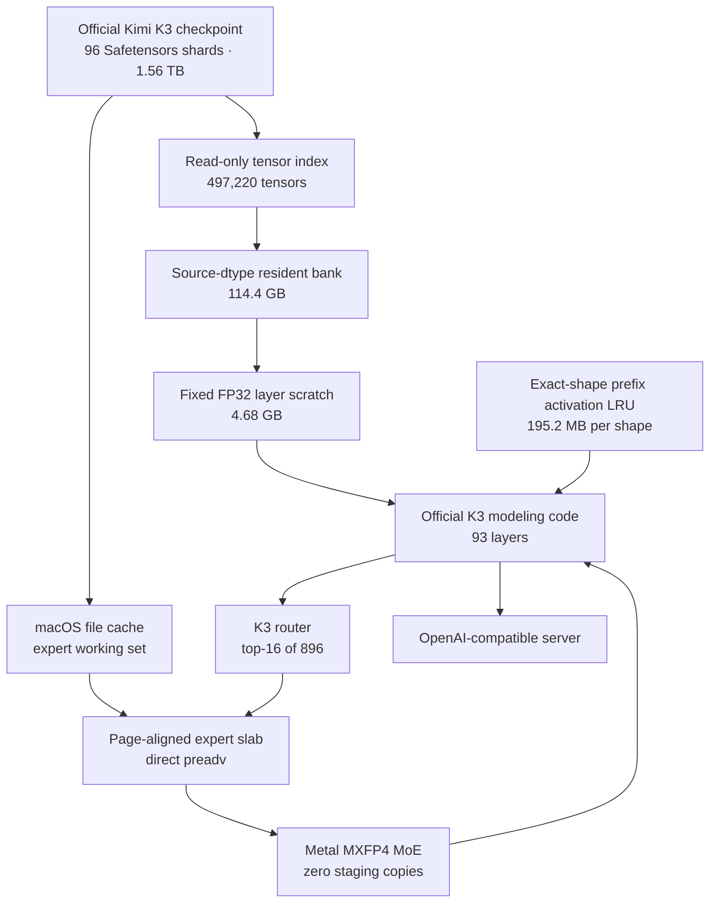

<div align="center">

# Deltafin — Kimi K3 on a Single M3 Ultra

**Run the official 1.56 TB Kimi K3 checkpoint directly from its original Safetensors shards on one 512 GB Apple Silicon Mac.**

[](https://huggingface.co/moonshotai/Kimi-K3)


</div>

---

## Overview

This repository is a specialized fork of [gavamedia/deltafin](https://github.com/gavamedia/deltafin) for one deliberately narrow target:

> **Kimi K3 on a Mac Studio M3 Ultra with 512 GB unified memory, using the unmodified official checkpoint.**

The implementation intentionally gives up broad hardware portability in exchange for a controlled, measurable, exact execution path.

The official Kimi K3 checkpoint is approximately 1.56 TB. It is too large to reside entirely in 512 GB of unified memory, but its routed Mixture-of-Experts structure makes selective loading possible:

* the non-routed resident spine remains permanently on MPS;
* only the 16 experts selected by each routed layer are read;
* expert bytes are read directly from the original 96 Safetensors shards;
* macOS file cache retains the active expert working set;
* no model conversion, re-quantization, weight copy, or independent expert cache is required.

This is not intended to make K3 an interactive chat model. The target use case is slow, high-value, long-prompt, one-shot inference:

* architecture and implementation planning;
* project direction;
* design review;
* quality assurance;
* synthesis of large evidence packages;
* independent final review by a locally owned frontier-scale model.

## Project status

The core inference engine is complete.

| Capability                                 | Status            |
| ------------------------------------------ | ----------------- |
| Official 96-shard checkpoint direct access | Complete          |
| All 82,432 routed experts indexed          | Complete          |
| Resident spine direct loading              | Complete          |
| Metal zero-copy expert slabs               | Complete          |
| All 93 layers                              | Complete          |
| Serial single-token inference              | Complete          |
| Multi-token decode                         | Complete          |
| Multi-token prefill                        | Complete          |
| KV, KDA, and convolution state             | Complete          |
| Long-lived OpenAI-compatible server        | Complete          |
| macOS page-cache convergence               | Complete          |
| Shape-stable prefix activation replay      | Complete          |
| Request-level I/O and cache telemetry      | Complete          |
| Privacy-minimized prompt-shape tracing     | Complete          |
| Scan-resistant admission experiment        | Complete          |
| Passive admission selection gate           | Complete          |
| Exact output contract                      | Bitwise validated |

The selected M3 Ultra profile remains conservative:

* exact FP32 runtime numerics;
* official source-dtype resident storage;
* one fixed FP32 scratch slot;
* serial expert delivery;
* adaptive expert prefetch disabled;
* two-entry exact-shape prefix activation LRU;
* standard LRU admission retained by the M16 passive-evidence gate.

## Headline results

### Resident memory crossover

The official resident tensors occupy 114.4 GB in their checkpoint-native dtypes.

A full permanent FP32 resident bank used 228.8 GB and displaced expert pages from the macOS file cache. The selected source-dtype bank plus a fixed FP32 scratch arena uses 119.1 GB.

| Resident strategy                | Permanent MPS storage |       Decode time | Physical RAID read |
| -------------------------------- | --------------------: | ----------------: | -----------------: |
| Full FP32 bank                   |            228.764 GB |    16.263 s/token |     9.541 GB/token |
| **Source dtype + fixed scratch** |        **119.086 GB** | **8.119 s/token** | **4.025 GB/token** |

The selected path returns approximately **109.7 GB** to the operating system. That additional file-cache capacity was more valuable than keeping all resident tensors permanently expanded to FP32.

All 32 compared tokens, routes, and FP32 logits were bitwise identical.

See [M8: resident cache crossover](docs/m3ultra512-m8-cache-crossover.md).

### Long-lived runtime convergence

A long-lived process allows macOS to retain the routed expert working set.

| Request                          |           Time |  Physical read |
| -------------------------------- | -------------: | -------------: |
| Anchor, first execution          | 12.844 s/token | 8.385 GB/token |
| Anchor after unrelated request B |  4.051 s/token | 0.160 GB/token |
| Anchor after unrelated request C |  4.105 s/token | 0.158 GB/token |

The cumulative routed working set reached 268.1 GB. Previously used anchor pages remained available after more than 163 GB of unrelated expert pages had been touched.

No anonymous expert cache is used. These are ordinary file-backed pages from the unchanged official Safetensors files.

See [M9: long-lived cache convergence](docs/m3ultra512-m9-long-lived.md).

### Multi-token prefill

The bounded prefill path preserves the full prompt shape and can process more than 16 unique experts per layer without converting the checkpoint.

| Prompt                        | Prefill time | Logical expert bytes | Physical RAID read |
| ----------------------------- | -----------: | -------------------: | -----------------: |
| 2 tokens                      |     36.059 s |            74.927 GB |          40.321 GB |
| 8 tokens                      |     98.393 s |           155.416 GB |          84.710 GB |
| 89-token official chat prompt |    655.657 s |           624.174 GB |         555.634 GB |

The 89-token prompt selected as many as 550 unique experts in one layer. Peak active slab storage was 9.651 GB.

Prompt logits, first-decode logits, all routed positions, and all 324 KV/KDA/convolution state tensors were bitwise identical to the reference path.

See [M10: bounded multi-token prefill](docs/m3ultra512-m10-prefill.md).

### Shape-stable prefix activation reuse

The official chat template has a fixed 74-token prefix. Re-running its routed MoE work for every request is extremely expensive.

The selected optimization preserves the complete monolithic prompt shape while replaying only the fixed prefix’s previously validated routed-MoE activations.

| Path                    |       Prefill | One-token decode | Physical RAID read |
| ----------------------- | ------------: | ---------------: | -----------------: |
| Monolithic oracle       |     710.321 s |         15.922 s |         600.506 GB |
| **Shape-stable replay** | **115.160 s** |      **5.165 s** |      **87.533 GB** |

Results:

* prefill improved by approximately **6.17×**;
* physical storage traffic fell by approximately **85%**;
* 108,928 route edges were omitted;
* 25,401 layer-local expert loads were avoided;
* retained activation storage was 195.2 MB per prompt shape;
* prompt logits, decode logits, routes, and runtime state remained bitwise identical.

See [M12: shape-stable prefix activation reuse](docs/m3ultra512-m12-prefix-activation.md).

### OpenAI server capture and replay

The same optimization works in the normal OpenAI-compatible server path.

| Request | Action  |      TTFT | Logical expert bytes | Physical RAID read |
| ------- | ------- | --------: | -------------------: | -----------------: |
| `Hello` | capture | 717.654 s |           598.344 GB |         598.809 GB |
| `World` | replay  | 135.694 s |           165.576 GB |         107.127 GB |

The replay request improved TTFT by **5.29×** and reduced physical member traffic by **82.11%**.

See [M13: server workload validation](docs/m3ultra512-m13-server-workload.md).

> Benchmark values are natural-cache measurements. macOS does not expose a reliable global page-cache purge, and `F_NOCACHE` does not make repeated runs equivalent cold trials.

## Architecture



### Direct official-shard access

The checkpoint contains:

* 96 Safetensors shards;
* 497,220 tensors;
* 82,432 routed experts;
* 494,592 expert tensors;
* 2,628 non-routed resident tensors.

Every routed expert contains six tensors. In the official checkpoint, all six are contiguous inside one shard.

Therefore:

* one expert is one contiguous span;
* one expert is exactly 17,547,264 bytes;
* every expert can be loaded with one positional read;
* no repacking or model conversion is necessary.

A small sidecar index records offsets and metadata. It contains no model weights and can be regenerated from the official checkpoint.

### Resident ownership

The selected runtime permanently stores tensors in their official source dtypes:

| Type      | Tensor count |                   Storage |
| --------- | -----------: | ------------------------: |
| BF16      |        2,122 |     114,359,769,088 bytes |
| F32       |          506 |          44,489,728 bytes |
| **Total** |    **2,628** | **114,404,258,816 bytes** |

A fixed 4,681,786,368-byte FP32 scratch arena materializes one layer at a time.

The same pointer, layout, FP32 views, `nn.Parameter` objects, and meta sentinels are reused. After every token, all 93 model layers are checked to ensure that they retain no non-meta resident tensors.

### Decode expert slab

Decode uses two reusable 16-expert banks.

* 16 KiB alignment;
* fixed addresses;
* direct `preadv`;
* no shared file-position state;
* no Metal staging copy;
* actual-route misses are filled into the existing bank;
* buffers are returned even when a background read fails.

The selected runtime uses strict serial delivery. Previous-token expert overlap is implemented and exact, but remains disabled because its additional unified-memory traffic exceeded the saved wait time.

### Prefill expert slab

Multi-token prefill can produce a union larger than 16 experts per layer.

The bounded prefill path:

1. computes position-specific routes;
2. collects the unique expert union for the layer;
3. reads each official expert span directly;
4. stores it in a fixed-address elastic slab;
5. executes position-major Metal MoE;
6. reuses the same storage for the next layer.

The virtual slab supports all 896 experts. Only touched slots acquire physical backing.

## Exactness contract

This branch treats the original monolithic, official-checkpoint, FP32 execution as the oracle.

Optimizations are selected only when the following remain exact:

* generated token IDs;
* expert IDs for all routed layers and positions;
* router weights where applicable;
* all 163,840 FP32 logits;
* KV state;
* KDA recurrent state;
* convolution state;
* subsequent decode behavior.

For the selected paths, comparisons use:

* bitwise tensor equality;
* `max_abs = 0`;
* SHA-256 hashes of complete FP32 logits;
* state tensor digests;
* official checkpoint tree fingerprints.

The model files are never modified during these tests.

## Why the model is not converted

This fork deliberately reads the official files in place.

No additional 1.56 TB model copy is required, and there is no conversion step that could:

* alter MXFP4 bytes;
* lose checkpoint provenance;
* require another multi-terabyte storage allocation;
* invalidate comparisons with the released model;
* need to be repeated after implementation changes.

The only generated model-related artifact is a small offset index without weight data.

## Intended use

This is not designed for rapid conversational interaction or multi-step agents.

Recommended workloads are:

* one-shot architecture reviews;
* implementation plans;
* project-wide direction;
* quality assurance reports;
* final review of work performed by faster models;
* synthesis of source code, experiment logs, and design evidence;
* long-running independent analysis where several minutes per token are acceptable.

A practical workflow is:

```text
Fast local models / coding agents
        ↓
collect code, tests, logs, papers, and decisions
        ↓
build one structured evidence package
        ↓
Kimi K3 one-shot review
        ↓
plan, direction, risk analysis, or QA report
```

## Requirements

The selected profile is specifically validated on:

* Mac Studio M3 Ultra;
* 512 GB unified memory;
* macOS;
* local official `moonshotai/Kimi-K3` checkpoint;
* approximately 1.6 TB of model storage;
* Python 3.12 or newer;
* PyTorch with MPS;
* Xcode Command Line Tools or Xcode;
* a local SSD or SSD array.

A slow SSD is supported, but cold execution is storage-bound. The development system used a USB SSD RAID whose sustained physical read rate was approximately 0.8–0.9 GB/s.

## Installation

### 1. Clone this branch

```bash
git clone \
  --branch m3ultra512-direct-shards \
  https://github.com/kiojuvr/deltafin.git

cd deltafin
```

### 2. Create the Python environment

```bash
python3.12 -m venv .venv

.venv/bin/python -m pip install --upgrade pip

.venv/bin/pip install \
  torch \
  numpy \
  safetensors \
  tiktoken \
  ml_dtypes \
  blobfile \
  "transformers==4.56.2" \
  einops \
  tokenizers
```

### 3. Build the native libraries

```bash
.venv/bin/python tools/build_native.py
```

### 4. Download the official model

Install the Hugging Face CLI and download the complete official repository:

```bash
python3 -m pip install --user --upgrade huggingface_hub hf-xet

hf auth login

hf download moonshotai/Kimi-K3 \
  --revision main \
  --local-dir "/Volumes/USB-SSD-RAID-0/models/moonshotai/Kimi-K3" \
  --max-workers 2
```

The expected model payload is approximately 1.56 TB across 96 weight shards.

### 5. Configure the M3 Ultra profile

Edit:

```text
config/m3ultra512.env
```

Set `K3_MODEL_DIR` to the local official model directory:

```bash
K3_MODEL_DIR=/Volumes/USB-SSD-RAID-0/models/moonshotai/Kimi-K3
```

Load the profile:

```bash
set -a
source config/m3ultra512.env
set +a
```

The selected profile requires:

```bash
K3_ALLOW_HTTP=0
K3_ALLOW_MODEL_CONVERSION=0

K3_EXPERT_SOURCE=direct-shards
K3_RESIDENT_SOURCE=direct-shards

K3_RESIDENT_BANK=1
K3_RESIDENT_BANK_DTYPE=source
K3_RESIDENT_SCRATCH=1
K3_RESIDENT_SCRATCH_SLOTS=1
K3_RESIDENT_SCRATCH_OVERLAP=0
K3_PIN_LAYERS=0

K3_DIRECT_SLAB=1
K3_DIRECT_PREFILL_SLAB_EXPERTS=896
K3_METAL_POSITION_BATCH=1
K3_DIRECT_OVERLAP=0

K3_PREFIX_ACTIVATION=1
K3_PREFIX_ACTIVATION_ENTRIES=2
K3_PREFIX_ACTIVATION_ADMISSION=lru

K3_DTYPE=fp32
K3_APPROX=0
```

## Running the CLI

```bash
set -a
source config/m3ultra512.env
set +a

.venv/bin/python tools/kimi_run.py \
  --chat \
  --prompt "Review this architecture and identify the most important risks."
```

Raw completion:

```bash
.venv/bin/python tools/kimi_run.py \
  --prompt "The capital of France is" \
  --max-new 16
```

## OpenAI-compatible server

Start one long-lived process so that the resident bank and expert file-cache working set survive across requests:

```bash
set -a
source config/m3ultra512.env
set +a

.venv/bin/python tools/serve_openai.py --port 8000
```

Example request:

```bash
curl http://127.0.0.1:8000/v1/chat/completions \
  -H 'Content-Type: application/json' \
  -d '{
    "model": "deltafin-kimi-k3",
    "messages": [
      {
        "role": "user",
        "content": "Review the supplied evidence and produce a prioritized implementation plan."
      }
    ],
    "max_tokens": 128
  }'
```

Python client:

```python
from openai import OpenAI

client = OpenAI(
    base_url="http://127.0.0.1:8000/v1",
    api_key="none",
    timeout=60 * 60 * 24,
)

response = client.chat.completions.create(
    model="deltafin-kimi-k3",
    messages=[
        {
            "role": "user",
            "content": (
                "Review the supplied evidence and produce a prioritized "
                "implementation plan."
            ),
        }
    ],
    max_tokens=128,
)

print(response.choices[0].message.content)
```

The server implements:

* `/v1/chat/completions`;
* `/v1/completions`;
* `/v1/models`;
* streaming responses;
* one active request at a time.

Client timeouts should be measured in hours, not seconds.

## Prefix activation cache

The official chat template currently exposes a fixed 74-token prefix.

For each complete prompt length, the runtime may retain:

* the validated prefix MoE input;
* the routed MoE output for the prefix positions;
* exact route IDs and router weights;
* execution-shape metadata.

Each entry uses approximately 195.2 MB.

The cache key includes the complete prompt length because Metal floating-point reduction order is shape-dependent. A prompt with 89 positions and one with 90 positions cannot share an exact entry.

The selected cache has two entries:

```bash
K3_PREFIX_ACTIVATION_ENTRIES=2
K3_PREFIX_ACTIVATION_ADMISSION=lru
```

On every replay:

1. the full monolithic prompt shape is preserved;
2. prefix inputs are recomputed and checked bitwise;
3. prefix route IDs and router weights are checked bitwise;
4. only validated prefix routed-MoE outputs are replayed;
5. suffix positions execute normally;
6. the hook is removed before decode;
7. any mismatch invalidates the entry.

### Experimental repeat admission

A scan-resistant admission policy is available:

```bash
K3_PREFIX_ACTIVATION_ADMISSION=repeat
K3_PREFIX_ACTIVATION_HISTORY=4096
```

When the cache is full:

* a first-seen prompt shape is captured for the current request but not retained;
* a repeated shape may enter the LRU;
* one-off scans do not immediately evict known reusable shapes.

In a 42-request scan-heavy synthetic trace with capacity two:

| Policy           | Hits |
| ---------------- | ---: |
| LRU              |    4 |
| Repeat admission |    7 |

The M16 passive trace contained one eligible request and no exact-shape reuse,
so it could not justify a controlled server A/B or a policy change. Repeat
admission remains experimental and standard LRU is still selected.

See [M15: repeat-aware admission](docs/m3ultra512-m15-repeat-admission.md).
See [M16: passive admission gate](docs/m3ultra512-m16-admission-gate.md).

## Telemetry

### Full request metrics

Set:

```bash
K3_SERVER_METRICS_JSONL=bench-results/server-metrics.jsonl
```

The server can record:

* TTFT;
* request wall time;
* logical expert bytes;
* physical RAID member bytes;
* estimated page-cache contribution;
* routed working-set growth;
* prefix activation action and LRU state;
* MPS allocation;
* compressor and swap state;
* memo status.

### Privacy-minimized shape trace

The selected M3 Ultra profile enables a lightweight trace:

```bash
K3_SERVER_SHAPE_TRACE_JSONL=bench-results/m14-server-shapes.jsonl
K3_SERVER_SHAPE_TRACE_MAX_BYTES=16777216
```

It records only:

* total prompt positions;
* eligibility;
* activation hit preview;
* admission action;
* current LRU shape list;
* anonymous request ID;
* timestamp and request mode.

It does **not** record:

* prompt text;
* token IDs;
* decoded tokens;
* prompt hashes;
* message contents.

The trace rotates at 16 MiB and retains one backup, limiting storage to approximately 32 MiB.

Analyze a trace with:

```bash
.venv/bin/python tools/m14_shape_trace.py \
  --shape-jsonl bench-results/m14-server-shapes.jsonl \
  --max-capacity 16
```

## Experiments that were not selected

Correctness alone was not enough for an optimization to become the default.

### Previous-token expert overlap

The previous token reused only 19.46% of routed experts.

Overlap reduced critical expert wait slightly but transferred tens of gigabytes of unnecessary data and made warm execution slower.

Status: implemented, bitwise exact, default off.

### Adaptive partial prefetch

Router-weight-ranked candidates achieved high precision, and a demand-bandwidth cold gate completely stopped warm prefetch.

However, controlled cold acceleration could not be demonstrated. Run-to-run physical I/O variation exceeded the measured effect.

Status: implemented, exact, default off.

### Two-slot resident conversion overlap

A worker successfully converted the next resident layer while the current layer executed, but conversion and Metal compute competed for unified-memory bandwidth.

One serial scratch slot was faster and used less memory.

Status: rejected.

### Segmented prefix-state snapshot

A 74-token immutable state snapshot restored 324 KV/KDA/convolution tensors in less than one millisecond and was bitwise exact against the same segmented execution.

It was not exact against the selected monolithic 89-token execution. Changing the MPS position dimension from `T=89` to `T=74` plus `T=15` changed floating-point reduction order, causing route divergence across later layers.

Status: experimental only, default off.

### Larger activation LRU

A scan-heavy 42-request trace contained 32 exact prompt shapes. Capacity three improved over capacity two, but capacities four through fourteen added memory without additional hits.

Status: capacity two retained. M16's available passive trace had no reuse and
therefore did not authorize a controlled policy A/B.

## Validation history

| Milestone | Result                                                                  | Report                                                        |
| --------- | ----------------------------------------------------------------------- | ------------------------------------------------------------- |
| M0        | All official expert spans indexed and directly readable                 | [Direct shards](docs/m3ultra512-direct-shards.md)             |
| M1        | Resident direct read, real-layer parity, aligned slabs, Metal zero-copy | [Layer parity](docs/m3ultra512-m1-layer-parity.md)            |
| M1-D      | Complete resident MPS ownership and 30-minute stability                 | [Resident validation](docs/m3ultra512-m1d-resident.md)        |
| M2        | Strict serial full-model token, bitwise exact                           | [Serial token](docs/m3ultra512-m2-serial-token.md)            |
| M3        | Multi-token and next-layer overlap validation                           | [Overlap](docs/m3ultra512-m3-overlap.md)                      |
| M4        | High-confidence adaptive partial prefetch                               | [Adaptive prefetch](docs/m3ultra512-m4-adaptive-prefetch.md)  |
| M5        | Demand-bandwidth cold gate                                              | [Cold gate](docs/m3ultra512-m5-cold-gate.md)                  |
| M6        | Official source-dtype resident bank                                     | [Source resident](docs/m3ultra512-m6-source-resident.md)      |
| M7        | Fixed FP32 resident scratch arena                                       | [Resident scratch](docs/m3ultra512-m7-resident-scratch.md)    |
| M8        | Source-resident cache-capacity crossover                                | [Cache crossover](docs/m3ultra512-m8-cache-crossover.md)      |
| M9        | Long-lived request cache convergence                                    | [Long-lived runtime](docs/m3ultra512-m9-long-lived.md)        |
| M10       | Bounded multi-token direct-shard prefill                                | [Multi-token prefill](docs/m3ultra512-m10-prefill.md)         |
| M11       | Prefix-state snapshot falsification                                     | [Prefix state](docs/m3ultra512-m11-prefix-state.md)           |
| M12       | Shape-stable exact prefix activation replay                             | [Prefix activation](docs/m3ultra512-m12-prefix-activation.md) |
| M13       | OpenAI server capture/replay telemetry                                  | [Server workload](docs/m3ultra512-m13-server-workload.md)     |
| M14       | Privacy-minimized passive shape tracing                                 | [Shape trace](docs/m3ultra512-m14-shape-trace.md)             |
| M15       | Scan-resistant repeat admission                                         | [Repeat admission](docs/m3ultra512-m15-repeat-admission.md)   |
| M16       | Passive evidence gate retained exact LRU                                 | [Admission gate](docs/m3ultra512-m16-admission-gate.md)       |

## Current limitations

* The implementation is specialized for a Mac Studio M3 Ultra with 512 GB unified memory.
* Performance is heavily dependent on physical SSD bandwidth and macOS page-cache state.
* Cold expert reads remain slow on USB storage.
* The first request for a new total prompt length must capture prefix activations at full cost.
* Prefix activation reuse requires an exact total-position match.
* The server processes one request at a time.
* Greedy exact decoding is the validated path.
* Long answers remain slow even after the expert working set becomes warm.
* This is a research runtime, not a production serving system.
* A complete Kimi K3 download requires approximately 1.6 TB.
* The selected profile intentionally disables several generic upstream features.

## Development principles

This branch follows four rules:

1. **Correctness before speed.**
2. **Never change the official checkpoint.**
3. **Measure physical I/O separately from logical delivery.**
4. **Reject optimizations that do not improve end-to-end execution.**

An optimization is not selected merely because it is asynchronous, has a high prediction hit rate, or improves one internal timer. It must preserve the exact contract and improve the complete workload.

## Next step

The engine itself is effectively complete.

The remaining work is operational evaluation:

* collect passive prompt-shape traces from actual use;
* compare standard LRU with repeat admission;
* run real long-prompt planning and QA tasks;
* evaluate answer quality against faster local models;
* determine whether faster NVMe storage is worth the cost;
* package the selected configuration as a reproducible research release.

## Acknowledgements

This fork builds on the work of:

* [gavamedia/deltafin](https://github.com/gavamedia/deltafin), the upstream project;
* [Moonshot AI](https://huggingface.co/moonshotai/Kimi-K3), for releasing Kimi K3 weights and modeling code;
* [ds4 / DwarfStar](https://github.com/antirez/ds4), for clear prior work on expert streaming and correctness-first inference;
* [flash-linear-attention](https://github.com/fla-org/flash-linear-attention), whose semantics informed the KDA compatibility path;
* [llama.cpp](https://github.com/ggml-org/llama.cpp), for prior work on low-bit formats and fused inference kernels;
* the original Deltafin contributors and the broader local-LLM community.

## License

MIT. See [LICENSE](LICENSE).

Kimi K3 weights and modeling code remain subject to their original license and terms.
